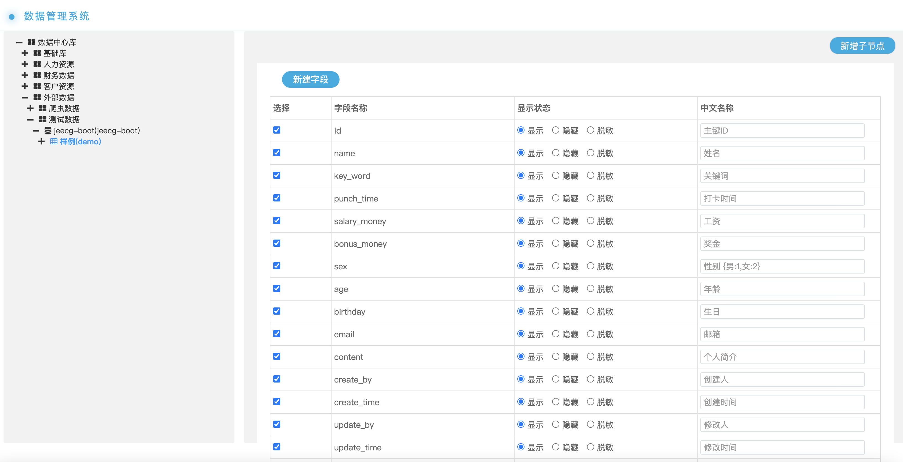
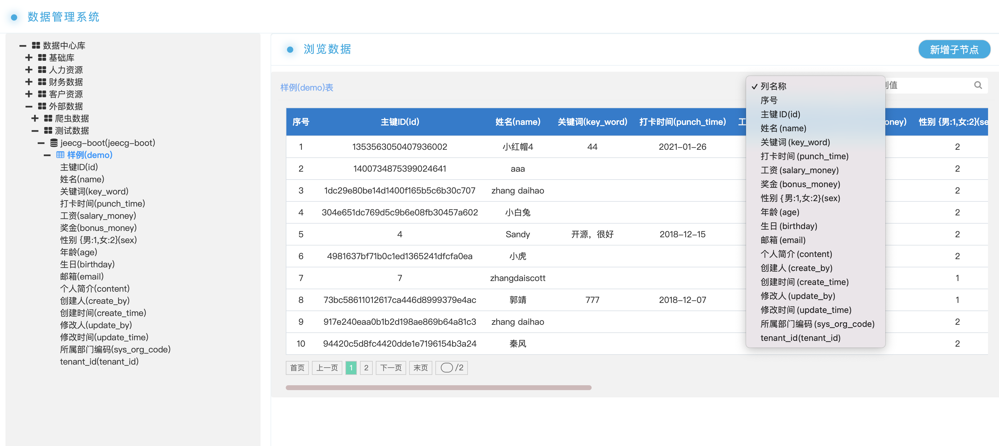

# Introduction 项目简介

This is a microservice that can aggregate multiple heterogeneous databases. It can aggregate multiple databases within this service, regardless of where your database is located or what type of database it is. As long as it is managed, it can provide external services and manage data permissions.
这是一个可以汇集多源异构数据库的微服务，它可以将多个数据库汇集在这个服务里面，不论你的数据库在哪，不论什么样的数据库，只要经过它的管理，就可以对外提供服务，并且可以管理数据的权限。

